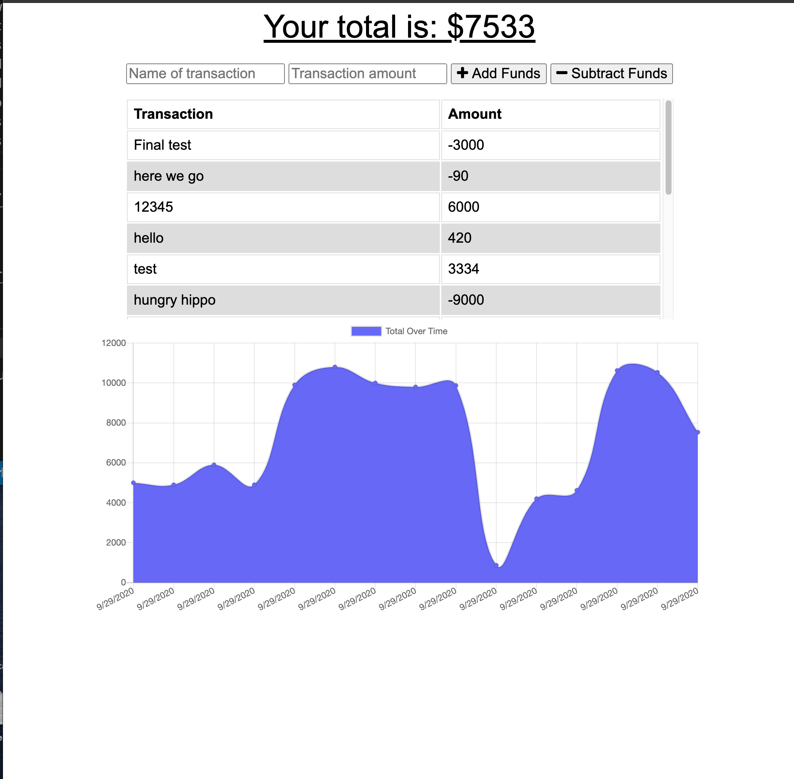

# Online-Offline_Budget_Tracker_Assign18

# Table of Contents:
1. [Description](#Description)
2. [Process](#Process)
3. [Issues](#Issues)
4. [Improvement](#Improvement)
5. [Link](#Link)
6. [Screenshot](#Screenshot)

# Description: 
This assignment focused on taking my newfound knowledge of working with PWA (Progressive Web Apps), and building a functioning backend for a budget tracker that would work both online and offline. In order to do this I needed to apply my knowledge of express, mongoose, mongoD, compression, and lite-server so that the application could allow the user to enter their expenses or additions offline, and upon returning online they would be able to view those same transactions. 

# Process:
* First I established a manifest.json which would serve as a host for the different icons provided in the repository so that they could be displayed while offline
* From there I created service-worker.js, which first building an install request that would take the required scripts needed to make the application function offline, and cache them.
* In the service-worker.js I then created an activate request, which will search for older caches and clean them up, replacing them if they match the name of the caches we are attempting to load.
* Finally in the service-worker.js I built a fetch request that will take the "get" requests to /api routes, cloning it into the cache, and then returning the cached home page.  
* Finally in order to make this function offline I would need to build a db.json that would contain the IndexedDB, a type of database that would temporarily hold the entries made by the user until a fetch request could be made when the user returns online.   

# Issues:
* In our previous week of class we did not go over IndexedDB at all, which led to a lot of confusion on how to proceed with this assignment. In the end I needed to do a vast amount of independent research, consult frequently with Learning Assistants, and lean heavily on the solved file used in week 17's mini-project.    
* Another issue I ran across is that the activate request in service-worker, while it works fine on the localhost, breaks the heroku website when it goes offline. I have commented it out and the website now functions as expected.

# Improvements:
When provided half of the code necesscary to make this application run, there are bound to be some things that could be improved upon in that file. With the index.js, whoever built it designed it so that when the user refreshes the page while offline, it will remove the display of their entries made while offline, but their data will still be hosted in the IndexedDB so that it will show up when they go back online. Coordinating with Learning Assistant Isabel, we found that the only way to fix this would be to entirely restructure the index.js, which was provided to us as boiler plate. Attempting to solve it in my own files would cause an issue with duplicate entries showing up on the display. For this homework assignment I decided to leave it be as it did not interfere with our objectives, but if I had more time I would restructure said file so that it would not have this issue.  

# Link:
[Deployed Website](https://budget-tracker-u-of-u.herokuapp.com/)

# Screenshot:

